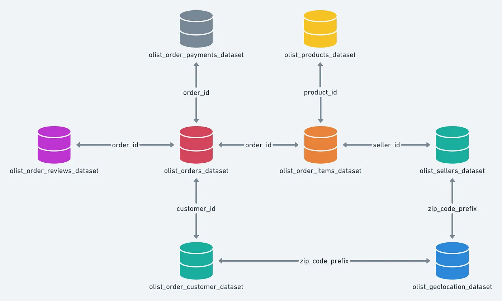

# Olist Customer Segmentation

<!-- Logo Olist centré -->
<p align="center">
  
</p>

> Segmentation non supervisée des clients d'Olist afin de permettre
> à l'équipe marketing de personnaliser ses campagnes de communication
> selon le profil comportemental de chaque groupe de clients.


---

## Contexte

Olist est une entreprise brésilienne qui connecte les petits marchands
aux grandes marketplaces en ligne (Amazon, Mercado Livre, etc.).
Face à une base de plus de 90 000 clients aux comportements très variés,
l'équipe marketing ne peut pas appliquer une stratégie de communication
unique à tous. Ce projet vise à identifier automatiquement des groupes
de clients homogènes à partir de leurs données comportementales
(historique d'achats, satisfaction, géographie) pour permettre des
campagnes ciblées et mesurables.

---

## Schéma de la base de données

Les données comprennent l'historique des commandes de 2016 à 2018 et contiennent 100 000 commandes. Huit fichiers sont disponibles. Le modèle de données ci-dessous présente les relations entre ces tables de données et de correspondance. Ces données ont été gracieusement fournies par Olist sous licence CC BY-NC-SA 4.0 et sont disponibles sur Kaggle.

<p align="center">
  
</p>

---

## Objectifs

- **ML** : Construire un modèle de clustering non supervisé (K-Means,
  DBSCAN, CAH) pour segmenter les clients selon leurs features RFM
  et comportementales, évalué par score de silhouette et Davies-Bouldin.
- **MLOps** : Mettre en place un pipeline reproductible avec DVC,
  tracker les expériences sur MLflow (≥ 10 runs), déployer une API
  FastAPI dans Docker et automatiser les tests via GitHub Actions.
- **Business** : Fournir à l'équipe marketing une description
  actionnable de chaque segment (taille, valeur, comportement)
  et une recommandation de fréquence de mise à jour du modèle.

---

## Structure du projet
```
olist-customer-segmentation/
├── assets/
│   └── images/
├── notebooks/
│   ├── segmentation_01_eda.ipynb
│   ├── segmentation_02_modeling.ipynb
│   └── segmentation_03_simulation.ipynb
├── src/
│   ├── __init__.py
│   ├── data/
│   │   ├── __init__.py
│   │   └── load_data.py
│   ├── features/
│   │   ├── __init__.py
│   │   └── build_features.py
│   ├── models/
│   │   ├── __init__.py
│   │   ├── train.py
│   │   └── predict.py
│   └── api/
│       ├── __init__.py
│       └── main.py
├── tests/
│   ├── __init__.py
│   ├── test_load_data.py
│   ├── test_build_features.py
│   └── test_predict.py
├── data/
│   ├── raw/          # données Olist originales — gérées par DVC
│   └── processed/    # features engineerées — gérées par DVC
├── models/           # artefacts .pkl loggés par MLflow
├── .github/
│   └── workflows/
│       └── ci.yml
├── Dockerfile
├── docker-compose.yml
├── dvc.yaml
├── .dvcignore
├── pyproject.toml
├── setup.py
├── requirements.txt
├── .gitignore
└── README.md
```

---

## Installation & lancement

### Prérequis
- Docker & Docker Compose
- Python 3.9+
- Compte Kaggle (pour télécharger le dataset)

### Lancement complet avec Docker *(recommandé)*
```bash
# 1. Cloner le repo
git clone https://github.com/thiernodaoudaly/olist-customer-segmentation.git
cd olist-customer-segmentation

# 2. Placer les données Olist dans data/raw/
# Télécharger depuis :
# https://www.kaggle.com/datasets/olistbr/brazilian-ecommerce

# 3. Lancer l'environnement complet (API + MLflow)
docker-compose up --build
```

| Service | URL | Description |
|---|---|---|
| API FastAPI | http://localhost:8000 | Endpoint de segmentation |
| Swagger UI | http://localhost:8000/docs | Documentation interactive |
| MLflow UI | http://localhost:5000 | Tracking des expériences |

### Lancement sans Docker
```bash
python -m venv venv && source venv/bin/activate
pip install -r requirements.txt && pip install -e .
uvicorn src.api.main:app --reload
```

---

## Reproduire les expériences MLflow
```bash
# Lancer un entraînement et logger dans MLflow
python src/models/train.py

# Ouvrir l'interface MLflow
mlflow ui --port 5000
```

---

## Tests
```bash
# Lancer tous les tests unitaires
pytest tests/ -v

# Avec rapport de couverture de code
pytest tests/ -v --cov=src --cov-report=html
```

---

## Résultats

| Modèle | n_clusters | Silhouette Score | Davies-Bouldin |
|---|---|---|---|
| — | — | — | — |

> *(à compléter après la modélisation — notebook 02)*

---

## Contrat de maintenance

> *(à compléter après le notebook de simulation — notebook 03)*

---

## Auteur

**Thierno Daouda LY**
[GitHub](https://github.com/thiernodaoudaly)